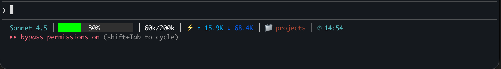
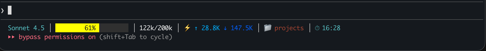
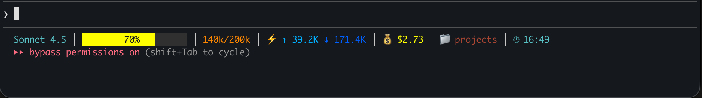

# Claude Code Statusline

A highly customizable, colorful statusline for Claude Code with dynamic progress indicators, token tracking, git integration, automatic updates, and 16 configurable sections.

## Screenshots


*Example statusline showing model, progress bar, tokens, git branch, and directory*


*Statusline with session cost tracking and cache statistics enabled*


*Customized layout with different color scheme and icon configuration*

## Features

- **16 Configurable Sections**: Model name, progress bar, tokens, git, directory, time, and more
- **Dynamic Progress Bar**: Color-coded context usage visualization (green/yellow/red)
- **Token Tracking**: Input/output tokens with autocompact warnings
- **Session Cost Calculator**: Real-time cost tracking based on Anthropic API pricing
- **Git Integration**: Shows current branch when in a git repository
- **Vim Mode Support**: Display INSERT/NORMAL mode indicators
- **Automatic Updates**: Check for new versions from GitHub (optional)
- **Session-Specific Cache**: Prevents data blinking, auto-cleaned when session ends
- **Fully Customizable**: Colors, icons, ordering, thresholds - everything is configurable
- **256-Color Support**: Use the full ANSI color palette
- **Modular Architecture**: Enable/disable sections individually

## Installation

1. Clone this repository or download the files
2. Copy files to `~/.claude/statusline/`:
   ```bash
   mkdir -p ~/.claude/statusline
   cp command.sh config.json README.md ~/.claude/statusline/
   chmod +x ~/.claude/statusline/command.sh
   ```

3. Update your `~/.claude/settings.json`:
   ```json
   {
     "statusLine": {
       "type": "command",
       "command": "~/.claude/statusline/command.sh",
       "padding": 0
     }
   }
   ```

4. Restart Claude Code or start a new session

## Requirements

- `jq` (JSON processor) - Install with: `brew install jq` (macOS) or `apt-get install jq` (Linux)
- `bc` (calculations)
- `git` (optional, for git branch display)

## Overview

Your statusline can display up to 16 different sections:

### Core Sections (Enabled by Default)
- **Model name** - Current Claude model (e.g., "Claude 3.5 Sonnet")
- **Dynamic progress bar** - Changes color based on context usage (green/yellow/red)
- **Context percentage** - Centered inside progress bar with adaptive text colors
- **Total tokens** - Used/available with autocompact warnings (e.g., "80k/200k")
- **Input/output tokens** - Cumulative session tokens with arrows (↑/↓)
- **Git branch** - Current branch if in a git repository
- **Current directory** - Basename of working directory
- **Current time** - 12h or 24h format

### Optional Sections (Disabled by Default)
- **Output style** - Current output style (e.g., "Explanatory", "Learning")
- **Vim mode** - Shows INSERT or NORMAL when vim mode is enabled
- **Session cost** - Calculated $ cost based on Anthropic API pricing (Haiku/Sonnet/Opus)
- **Cache stats** - Prompt caching read/write tokens (performance tracking)
- **Last call tokens** - Most recent message tokens (vs cumulative)
- **Agent name** - Shows when running with --agent flag
- **App version** - Claude Code version number
- **Project name** - Root project directory (vs current directory)

## Configuration File

Edit `~/.claude/statusline/config.json` to customize your statusline. All changes take effect on the next message.

---

## Section Ordering

**NEW:** You can now customize the order of sections in your statusline!

### How It Works

The `order` array in your config determines the sequence sections appear:

```json
"order": [
  "model",
  "progressBar",
  "totalTokens",
  "tokens",
  "git",
  "directory",
  "time"
]
```

### Customizing Order

Simply rearrange the array:

```json
"order": [
  "time",
  "directory",
  "git",
  "progressBar",
  "totalTokens",
  "tokens",
  "model"
]
```

Result: Time appears first, model appears last.

### Rules

- Sections only appear if enabled in `sections` AND present in `order`
- Sections enabled but not in `order` array will appear at the end
- You can omit sections from `order` to hide them without disabling

---

## Sections Configuration

Control which elements appear in your statusline:

```json
"sections": {
  "model": true,              // Model name
  "progressBar": true,        // Visual progress bar
  "totalTokens": true,        // Used/available tokens (80k/200k)
  "tokens": true,             // Input/output token counts
  "git": true,               // Git branch
  "directory": true,         // Current directory name
  "time": true,              // Current time

  // Optional sections (disabled by default)
  "outputStyle": false,      // Output style name
  "vimMode": false,          // Vim INSERT/NORMAL mode
  "sessionCost": false,      // Session cost in dollars
  "cacheStats": false,       // Cache read/write tokens
  "lastCallTokens": false,   // Last message tokens
  "agentName": false,        // Agent name (when using --agent)
  "appVersion": false,       // Claude Code version
  "projectName": false       // Root project directory
}
```

Set any to `false` to hide that section. Set to `true` to show.

---

## Colors

### Basic Color Codes

**Standard Colors (30-37, 90-97):**
- `30` = Black
- `31` = Red
- `32` = Green
- `33` = Yellow
- `34` = Blue
- `35` = Magenta
- `36` = Cyan
- `37` = White
- `90-97` = Bright versions (e.g., `97` = Bright White)

**256-Color Palette:**
Use `38;5;N` for foreground colors where N is 0-255.
Examples:
- `38;5;39` = Light Blue
- `38;5;208` = Orange
- `38;5;196` = Bright Red

[Full 256-color reference](https://en.wikipedia.org/wiki/ANSI_escape_code#8-bit)

### Core Section Colors

```json
"colors": {
  "model": "36",              // Model name color (cyan)
  "percentage": "97",         // Percentage text in progress bar (bright white)
  "git": "35",               // Git branch color (magenta)
  "directory": "31",         // Directory name color (red)
  "time": "36",              // Time display color (cyan)
  "separator": "37"          // Separator character color (white)
}
```

### Optional Section Colors

```json
"colors": {
  "outputStyle": "38;5;213",       // Output style (pink/magenta)
  "vimMode": {
    "insert": "38;5;46",           // INSERT mode (bright green)
    "normal": "38;5;33"            // NORMAL mode (blue)
  },
  "sessionCost": "38;5;226",       // Session cost (yellow)
  "cacheStats": "38;5;141",        // Cache statistics (purple)
  "lastCallTokens": "38;5;249",    // Last call tokens (gray)
  "agentName": "38;5;208",         // Agent name (orange)
  "appVersion": "38;5;244",        // App version (dark gray)
  "projectName": "38;5;99"         // Project name (purple)
}
```

### Total Tokens Colors

Changes based on remaining context space:

```json
"totalTokens": {
  "normal": "97",           // >60k tokens remaining (bright white)
  "warning": "38;5;208",    // 40k-60k remaining (orange)
  "critical": "31"          // <40k remaining (red)
}
```

### Token Arrow Colors

Different colors for input vs output:

```json
"tokens": {
  "icon": "34",            // Lightning bolt icon (blue)
  "input": "38;5;39",      // Input tokens ↑ (light blue)
  "output": "38;5;27"      // Output tokens ↓ (dark blue)
}
```

---

## Progress Bar

### Width

```json
"progressBar": {
  "width": 20              // Total width in characters (default: 20)
}
```

### Color Thresholds

When the progress bar changes color:

```json
"thresholds": {
  "yellow": 60,            // Turn yellow at 60% context usage
  "red": 80                // Turn red at 80% context usage
}
```

### Bar Colors

Background colors for the progress bar:

```json
"colors": {
  "green": "48;5;46",      // 0-60% usage (bright green)
  "yellow": "48;5;226",    // 60-80% usage (bright yellow)
  "red": "48;5;196",       // 80%+ usage (bright red)
  "empty": "48;5;236"      // Empty portion (dark gray)
}
```

Note: Background colors use `48;5;N` format (not `38;5;N`).

### Percentage Text Colors

The centered percentage text adapts based on position:

```json
"textColors": {
  "onFilled": "30",        // Text color when on filled portion (black)
  "onEmpty": "97"          // Text color when on empty portion (bright white)
}
```

---

## Token Warning Thresholds

Control when total tokens change color (based on autocompact buffer at 33k):

```json
"tokens": {
  "warningThresholds": {
    "warning": 60000,      // Turn orange when <60k tokens remain
    "critical": 40000      // Turn red when <40k tokens remain
  }
}
```

---

## Icons

### Enable/Disable

```json
"icons": {
  "enabled": true          // Set to false to hide all icons
}
```

### Customize Icons

```json
"icons": {
  "enabled": true,

  // Core sections
  "tokens": "⚡",          // Icon before token counts
  "git": "⎇",             // Icon before git branch
  "directory": "📁",      // Icon before directory name
  "time": "⏱",            // Icon before time

  // Optional sections
  "outputStyle": "✨",     // Icon before output style
  "vimMode": "✏️",         // Icon before vim mode
  "sessionCost": "💰",    // Icon before session cost
  "cacheStats": "💾",     // Icon before cache stats
  "lastCallTokens": "🔄", // Icon before last call tokens
  "agentName": "🤖",      // Icon before agent name
  "appVersion": "ⓘ",     // Icon before app version
  "projectName": "📂"     // Icon before project name
}
```

Popular alternatives:
- Tokens: `⚡ 🔥 ⭐ ●`
- Git: `⎇ 🌿  `
- Directory: `📁 📂 🗂️ ▶`
- Time: `⏱ 🕐 ⏰ ⌚`
- Cost: `💰 💲 💵 $`
- Vim: `✏️ 📝 ⌨️`

---

## Time Format

```json
"time": {
  "format": "24h"          // Use "12h" for 12-hour (2:30 PM)
                          // Use "24h" for 24-hour (14:30)
}
```

Note: Time only updates when messages are sent, not continuously.

---

## Session Cost Settings

The session cost is **automatically calculated** based on Anthropic API pricing for the model you're using. It includes input tokens, output tokens, and prompt caching costs.

### Pricing (per million tokens)

**Claude 3.5 Haiku:**
- Input: $0.80
- Output: $4.00
- Cache write: $1.00 (1.25x input)
- Cache read: $0.08 (10% of input)

**Claude 3.5 Sonnet:**
- Input: $3.00
- Output: $15.00
- Cache write: $3.75 (1.25x input)
- Cache read: $0.30 (10% of input)

**Claude 3 Opus:**
- Input: $15.00
- Output: $75.00
- Cache write: $18.75 (1.25x input)
- Cache read: $1.50 (10% of input)

### Display Settings

```json
"sessionCost": {
  "currencySymbol": "$",   // Currency symbol to display
  "decimals": 4            // Number of decimal places (e.g., $0.0042)
}
```

Examples:
- `"currencySymbol": "€", "decimals": 2` → €0.04
- `"currencySymbol": "¥", "decimals": 0` → ¥1

The cost is cumulative for the entire session and updates with each message.

---

## Separator

Character between sections:

```json
"separator": {
  "character": "│"         // Box drawing character (default)
}
```

Alternatives: `┃ | ▏ ▎ • · ❯ ›`

---

## Examples

### Minimal Setup

```json
"sections": {
  "model": true,
  "progressBar": true,
  "directory": true,
  "time": true
}
```

Result: `Claude 3.5 Sonnet │ ████ 40% ████ │ projects │ ⏱ 16:30`

### Developer Focus

```json
"sections": {
  "model": true,
  "progressBar": true,
  "totalTokens": true,
  "cacheStats": true,
  "lastCallTokens": true,
  "git": true,
  "directory": true
}
```

Result shows model, progress, tokens, cache stats, last call tokens, git, and directory.

### Vim User Setup

```json
"sections": {
  "vimMode": true,
  "model": true,
  "progressBar": true,
  "directory": true
},
"order": [
  "vimMode",
  "model",
  "progressBar",
  "directory"
]
```

Result: Vim mode appears first, prominently displayed.

### Custom Order - Time First

```json
"order": [
  "time",
  "model",
  "progressBar",
  "totalTokens",
  "tokens",
  "git",
  "directory"
]
```

Result: Time appears at the start instead of the end.

### Cost Tracking

```json
"sections": {
  "sessionCost": true,
  "totalTokens": true,
  "tokens": true
},
"sessionCost": {
  "currencySymbol": "$",
  "decimals": 4
}
```

Shows: `💰 $0.0234 │ ⚡ 38k/200k │ ↑ 25k ↓ 13k`

### Agent Mode

```json
"sections": {
  "agentName": true,
  "model": true,
  "progressBar": true
}
```

When running with `--agent`, shows: `🤖 test-runner │ Claude 3.5 Sonnet │ ...`

---

## Advanced Customization

### Reorder Everything

Put most important info first:

```json
"order": [
  "totalTokens",
  "progressBar",
  "git",
  "directory",
  "model",
  "time"
]
```

### Hide Icons for Clean Look

```json
"icons": {
  "enabled": false
}
```

Result: No emoji/symbols, just text and colors.

### Different Color Scheme

```json
"colors": {
  "model": "33",           // Yellow
  "git": "32",            // Green
  "directory": "34",      // Blue
  "time": "35"            // Magenta
}
```

### More Aggressive Warnings

```json
"progressBar": {
  "thresholds": {
    "yellow": 50,          // Warning earlier
    "red": 70             // Critical earlier
  }
},
"tokens": {
  "warningThresholds": {
    "warning": 80000,      // More conservative
    "critical": 60000
  }
}
```

---

## Section Reference

### Core Sections

| Section | Description | When Visible |
|---------|-------------|--------------|
| `model` | Model display name | Always (if enabled) |
| `progressBar` | Visual context usage bar | Always (if enabled) |
| `totalTokens` | Used/max tokens | When context data available |
| `tokens` | Input/output cumulative | When token data available |
| `git` | Branch name | When in git repository |
| `directory` | Current directory | Always (if enabled) |
| `time` | Current time | Always (if enabled) |

### Optional Sections

| Section | Description | When Visible | Useful For |
|---------|-------------|--------------|------------|
| `outputStyle` | Output style name | When style set | Knowing current mode |
| `vimMode` | INSERT/NORMAL | When vim enabled | Vim users |
| `sessionCost` | Total $ cost | When cost available | Budget tracking |
| `cacheStats` | Cache R/W tokens | When cache used | Performance optimization |
| `lastCallTokens` | Recent msg tokens | When data available | Per-message tracking |
| `agentName` | Agent identifier | When using --agent | Agent workflows |
| `appVersion` | Claude Code version | Always (if enabled) | Version tracking |
| `projectName` | Root project dir | Always (if enabled) | Multi-project work |

---

## Troubleshooting

### Statusline not showing

1. Check that the script is executable:
   ```bash
   chmod +x ~/.claude/statusline/command.sh
   ```

2. Verify settings.json points to the script:
   ```json
   "statusLine": {
     "type": "command",
     "command": "~/.claude/statusline/command.sh",
     "padding": 0
   }
   ```

3. Test the script manually:
   ```bash
   echo '{"model":{"display_name":"Test"},"workspace":{"current_dir":"/test"}}' | ~/.claude/statusline/command.sh
   ```

### Colors not showing

- Ensure your terminal supports ANSI colors
- Check that color codes are strings (in quotes): `"36"` not `36`
- Background colors use `48;5;N`, foreground uses `38;5;N` or standard codes

### Config changes not applying

- Restart Claude Code or start a new session
- Check JSON syntax (commas, quotes, brackets)
- Verify config file path: `~/.claude/statusline/config.json`
- Use a JSON validator: `jq . ~/.claude/statusline/config.json`

### Icons not displaying

- Ensure your terminal font supports Unicode/emoji
- Try simpler icons: `>` instead of `⎇`, `*` instead of `⚡`
- Set `"icons": { "enabled": false }` to disable all icons

### Section not appearing

- Check that section is enabled in `sections`
- Verify section is in the `order` array
- Check debug log if enabled: `cat /tmp/statusline-debug.log`

### Blinking sections

The caching system prevents blinking when opening "/" menus. Cache files are session-specific and automatically cleaned up when the session ends.

If you experience blinking:
- Cache files are stored in `${TMPDIR:-/tmp}/claude-statusline-${PPID}/`
- Enable debug logging to investigate: `"debug": { "enabled": true }`
- Each terminal session has its own cache directory

---

## Automatic Updates

The statusline can check for updates from GitHub automatically once per session.

### Configuration

```json
"updates": {
  "enabled": true,              // Enable/disable update checking
  "autoUpdate": false,          // Auto-download updates (false = notification only)
  "repository": "https://github.com/proxikal/claude-statusline",
  "notificationDuration": 30    // Seconds to show update notification
}
```

### How It Works

- **Check once per session**: Update check happens only on first statusline render
- **Notification**: If `autoUpdate` is `false`, shows update message in statusline for configured duration
- **Auto-update**: If `autoUpdate` is `true`, automatically downloads and installs the latest version
- **Session-specific**: Each new Claude session checks once

### Safety

- Set `autoUpdate: false` (default) to manually control updates
- Only enable `autoUpdate` if you trust the repository source
- Update notifications appear in the statusline temporarily, then disappear

### Manual Update

To manually update:
```bash
cd ~/.claude/statusline
curl -O https://raw.githubusercontent.com/proxikal/claude-statusline/main/command.sh
curl -O https://raw.githubusercontent.com/proxikal/claude-statusline/main/config.json
curl -O https://raw.githubusercontent.com/proxikal/claude-statusline/main/README.md
chmod +x command.sh
```

Or use git:
```bash
cd ~/path/to/claude-statusline
git pull
cp command.sh config.json README.md ~/.claude/statusline/
```

---

## Debug Mode

Enable debug logging to troubleshoot issues:

```json
"debug": {
  "enabled": true,
  "logFile": "/tmp/statusline-debug.log"
}
```

View logs:
```bash
cat /tmp/statusline-debug.log
tail -f /tmp/statusline-debug.log  # Watch in real-time
```

Debug output shows:
- Timestamp for each execution
- Key field values (used_percentage, tokens, etc.)
- Which sections are shown/hidden
- Cache status (saved/loaded)

Remember to disable debug mode after troubleshooting to avoid log file growth.

---

## Backup & Restore

### Create Backup

```bash
cp ~/.claude/statusline/command.sh ~/.claude/statusline/command.sh.backup
cp ~/.claude/statusline/config.json ~/.claude/statusline/config.json.backup
```

### Restore from Backup

```bash
cp ~/.claude/statusline/command.sh.backup ~/.claude/statusline/command.sh
cp ~/.claude/statusline/config.json.backup ~/.claude/statusline/config.json
chmod +x ~/.claude/statusline/command.sh
```

---

## For AI Assistants

When helping users customize their statusline:

### Core Principles

1. **Edit config only** - Never modify the `.sh` script directly
2. **Validate JSON** - Ensure proper syntax (commas, quotes, brackets)
3. **Use strings for colors** - Color codes must be in quotes: `"36"`
4. **Test changes** - Have user send a message to see changes

### Common Requests

**"Hide time"**
```json
"sections": { "time": false }
```

**"Change model color to green"**
```json
"colors": { "model": "32" }
```

**"Use 12-hour time"**
```json
"time": { "format": "12h" }
```

**"No icons"**
```json
"icons": { "enabled": false }
```

**"Show vim mode"**
```json
"sections": { "vimMode": true }
```

**"Reorder: put time first"**
```json
"order": ["time", "model", "progressBar", "..."]
```

### All Section Names

Valid section names for `sections` and `order`:
- `model`
- `progressBar`
- `totalTokens`
- `tokens`
- `git`
- `directory`
- `time`
- `outputStyle`
- `vimMode`
- `sessionCost`
- `cacheStats`
- `lastCallTokens`
- `agentName`
- `appVersion`
- `projectName`

---

## Technical Details

- **Script location**: `~/.claude/statusline/command.sh`
- **Config location**: `~/.claude/statusline/config.json`
- **Cache location**: `${TMPDIR:-/tmp}/claude-statusline-${PPID}/` (session-specific)
- **Repository**: https://github.com/proxikal/claude-statusline
- **Requires**: `jq` (JSON processor), `bc` (calculations), `git` (optional)
- **Updates**: Every message
- **Context window**: 200k tokens (33k autocompact buffer)
- **Architecture**: Function-based rendering with modular sections
- **Cache cleanup**: Automatic when session ends (PPID-based isolation)

---

## Contributing

Contributions are welcome! If you have ideas for new features or improvements:

1. Fork the repository
2. Create a feature branch
3. Make your changes
4. Submit a pull request

Please ensure your code follows the existing style and test thoroughly before submitting.

## License

MIT License - Feel free to use and modify as needed.

## Support

- **Issues**: https://github.com/proxikal/claude-statusline/issues
- **Discussions**: https://github.com/proxikal/claude-statusline/discussions

## Credits

Created for Claude Code with love by the community. Special thanks to all contributors who helped make this statusline awesome! 🎨

Enjoy your beautiful, fully customizable statusline!
